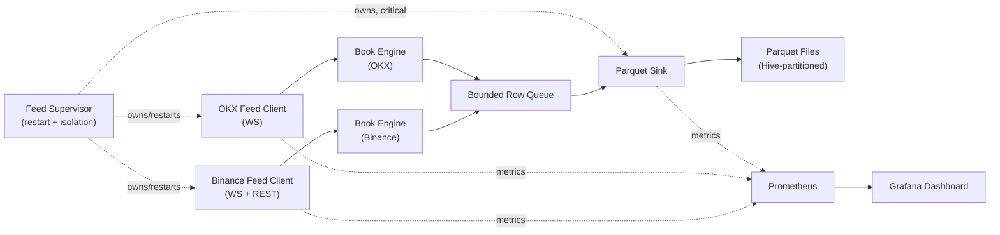
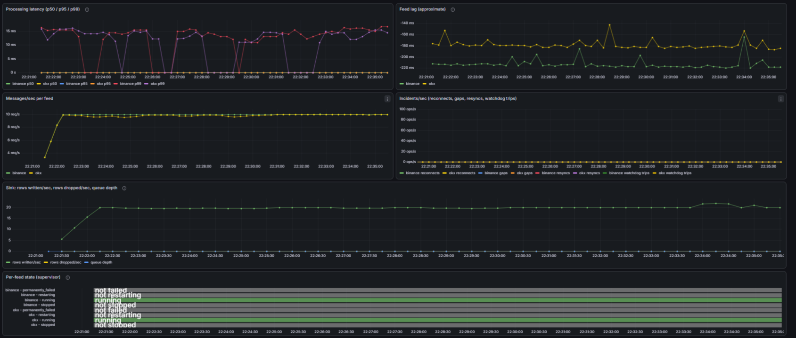

# l2-pipeline

[](LICENSE)

A multi-exchange L2 order book ingestion and reconstruction pipeline,
built the way a real market-data system would be built, not a demo
script. It follows each exchange's official synchronization protocol
behind a generalized, exchange-agnostic sync contract; its recovery
logic was proven correct with a deterministic fault-injection harness
*before* it was ever pointed at a real exchange; it isolates a single
feed's failure from the rest of the pipeline instead of taking the whole
process down; and it's observable end-to-end via Prometheus/Grafana.
Every claim in this README is backed by a real run: see
[BENCHMARKS.md](BENCHMARKS.md) for the numbers and
[DECISIONS.md](DECISIONS.md) for the reasoning behind every non-obvious
choice, including five real bugs this project's own verification
process caught, most recently a production livelock found during a
live multi-hour soak run.

## Architecture



Each feed client speaks its exchange's own WS/REST protocol and feeds a
**pure, exchange-agnostic** book engine through a generalized `prev_id`/
`final_id` sync contract. The same engine code runs unmodified for both
exchanges (verified via `git diff --stat` showing zero changes to
`book/`, `feeds/connection.py`, or `feeds/ratelimit.py` across the entire
OKX-integration milestone). Both feeds push into one shared, bounded
queue drained by a single Parquet sink. A `FeedSupervisor` (not
`asyncio.TaskGroup`, which would cancel every feed the instant one
crashes) owns all of it, restarting a crashed feed with jittered backoff
while leaving its sibling and the sink untouched, and treating a sink
crash as the one condition that triggers full graceful shutdown.

## Key engineering decisions

Each one line, with the full reasoning linked:

- **Generalized `prev_id`/`final_id` sync contract**, not exchange-native
  field names: lets one `BookEngine` handle Binance's contiguous-partition
  sequencing and OKX's chain-by-equality sequencing without knowing which.
  [details](DECISIONS.md#diffeventprev_id--final_id-not-binances-raw-u--u)
- **Deterministic fault-injection harness (DST lineage)** validates gap,
  duplicate, reorder, disconnect, and stale-snapshot recovery against an
  oracle book *before* any real exchange is touched, and stays
  reproducible byte for byte from a single seed.
  [details](DECISIONS.md#m2-deterministic-simulation--fault-injection)
- **Zero-line-diff proof**: adding OKX (M4) touched no line of `book/`,
  `connection.py`, or `ratelimit.py`. The exchange-agnostic design either
  holds under a second real protocol or it doesn't, and it did.
  [details](DECISIONS.md#the-architecture-validation-property-stated-and-verified)
- **`FeedSupervisor`, not `asyncio.TaskGroup`**: `TaskGroup` cancels every
  sibling task the instant one raises, the opposite of the per-feed
  isolation a multi-exchange pipeline needs.
  [details](DECISIONS.md#feedsupervisor-not-asynciotaskgroup)
- **Checkpoint-interval Parquet finalization**, not hourly-only: bounds
  an ungraceful crash's data loss to one checkpoint interval (5 min
  default) instead of up to a full hour.
  [details](DECISIONS.md#the-finalization-gap-from-up-to-an-hour-to-at-most-one-checkpoint-interval)
- **Metrics via a scrape-time `Collector`**, not duplicated instrumentation:
  `get_stats()` stays the single source of truth. The only hot-path
  metrics calls are the two that genuinely can't be reconstructed after
  the fact (processing latency, feed lag).
  [details](DECISIONS.md#pipelinecollector-read-get_stats-at-scrape-time-dont-double-instrument)
- **Two latency concepts, never conflated**: `processing_latency`
  (one monotonic clock, honestly precise) vs. `feed_lag` (cross-clock,
  explicitly labeled approximate in its own metric text).
  [details](DECISIONS.md#two-latency-concepts-never-conflated)
- **Five real bugs found by this project's own verification discipline**,
  not by luck: an off-by-one at M1, a Hypothesis-found race at M2, two at
  M7 (a Hive-partition/schema bug that 92 passing tests didn't catch but
  one manual pandas check did, and a monotonic-vs-epoch timestamp bug the
  stress test itself caught), and (the newest) a `ParquetSink` stall
  livelock found live during a multi-hour unattended soak run, where a
  queue kept filling and silently dropping rows for hours with no
  exception ever raised.
  [details](DECISIONS.md#m7-benchmark-report-stress-test-readme) /
  [M8 livelock](DECISIONS.md#m8-parquetsink-stall-livelock-production-incident)

## Fault tolerance

| Fault | Detection | Recovery | Test evidence |
|---|---|---|---|
| Dropped event | `prev_id` chain check fails (`GAP_DETECTED`) | Fetch fresh snapshot, replay straddling buffer | S2 |
| Dropped burst | Same chain-check mechanism | Same recovery path | S3 |
| Duplicate delivery | Chain check fails on the repeat | Resync, not silently absorbed | S4 |
| Reordered delivery | Chain check fails until order restored | Resync if still broken after in-order replay | S5 |
| Dead/disconnected connection (simulated) | Message-based watchdog timeout | Full-jitter backoff, reconnect, forced `invalidate()` | S6 |
| Dead/disconnected connection (live) | Same watchdog/backoff path, real network | Auto-reconnected without intervention during a 24-hour continuous Binance soak run | 24h soak (see Benchmark highlights) |
| Delayed/stale snapshot | Straddle-condition check on `load_snapshot()` (`SNAPSHOT_STALE`) | Bounded retry against a fresh snapshot | S7 |
| Multiple simultaneous faults | All of the above, at once | All of the above, at once | S8: 1,281 faults fired across 5,000 steps, **657/657 recoveries, zero unrecovered divergences** |
| A single feed crashing | N/A (process-level) | `FeedSupervisor` restarts with jittered backoff; sibling feed and sink untouched | P4 |
| The sink crashing | N/A (process-level) | Treated as process-critical: full graceful shutdown, not silently dropped rows | P5 |

Every scenario above (S1-S8) is byte-for-byte reproducible from a single
seed (D1).

## Benchmark highlights

Full methodology, all raw numbers, and honest limitations in
[BENCHMARKS.md](BENCHMARKS.md). Headlines:

- **24-hour continuous live Binance soak run**, unattended: connected/live
  book state maintained throughout, any real disconnects encountered
  auto-recovered without intervention, ended in a clean Ctrl+C graceful
  shutdown. One of the strongest pieces of live evidence in the project,
  since it's the one claim no synthetic test can stand in for.
- **No drop-based throughput ceiling found** for the queue/sink path from
  500 to 32,000 synthetic msg/sec (zero rows dropped anywhere in that
  range), with real production traffic running at ~18 msg/sec combined,
  roughly three orders of magnitude below the tested range.
- **Processing latency p50/p95 ≈ 25µs / 48µs** on live Binance and OKX
  traffic, consistent with the synthetic benchmark's own steady-state
  figures.
- **One profiling-justified optimization** (a 1.63x speedup in Parquet
  row serialization, verified in isolation), reported honestly alongside
  the finding that it didn't move the end-to-end number: the actual
  bottleneck at that plateau was scheduling overhead, not the function
  that got faster.
- **Fault-storm recovery: 657/657**, zero unrecovered divergences, fully
  reproducible from one seed.
- **Live Parquet correctness verified on real data**: 49,929 rows across
  a ~15-20 minute dual-feed run, correct Hive partitioning, zero crossed
  books.

## Demo



Cold-start sync from a real run (the same code path a mid-session gap
recovery takes: `load_snapshot()` doesn't know or care whether it's
being called at startup or after a detected gap). Not a mid-session
incident: no `GAP_DETECTED` appears in any saved soak-run log on hand,
so this is shown as what it actually is rather than relabeled as
something it isn't.

```
RESYNC_COMPLETED, binance, BTCUSDT, duration_seconds=0.14, attempts=1, events_buffered=1
RESYNC_COMPLETED, okx, BTC-USDT
```

## How to run it

### Requirements

- Python 3.12 (pinned, see [DECISIONS.md](DECISIONS.md)). If your system
  Python is a different version, install 3.12 separately (e.g. via the
  `py` launcher on Windows, or [pyenv](https://github.com/pyenv/pyenv) on
  macOS/Linux) and point `uv` at it: `uv venv --python 3.12`.
- [uv](https://docs.astral.sh/uv/) for dependency management.
- [Docker Desktop](https://www.docker.com/products/docker-desktop/)
  (optional, only needed for the Prometheus/Grafana observability stack).

### Setup

```bash
uv venv --python 3.12
uv sync
```

### Running the pipeline

```bash
uv run python -m l2_pipeline.app --config config/default.yaml
```

Config lives in `config/default.yaml`: exchanges/symbols, book depth,
Parquet output directory and queue sizing, and the metrics port. Parquet
output is Hive-partitioned under `output.parquet_dir`
(`exchange=.../symbol=.../date=.../hour=.../part-*.parquet`), readable
directly with `pandas.read_parquet(parquet_dir)` or any Hive-partition-
aware reader.

### Observability stack (Prometheus + Grafana)

```bash
docker compose -f ops/docker-compose.yml up
```

One command, zero manual clicking: the Prometheus scrape config and the
Grafana datasource + dashboard are all provisioned automatically from
committed files under `ops/`. Grafana is at `http://localhost:3000`
(anonymous viewer access enabled), Prometheus at `http://localhost:9090`.
The app itself runs on the host, not in the compose stack; Prometheus
reaches its metrics port via `host.docker.internal`.

### Development

```bash
uv run pytest       # tests (93 passing)
uv run mypy          # type checking (strict mode)
uv run ruff check .  # linting
```

CI is configured (`.github/workflows/ci.yml` runs all three commands
above on every push/PR) but not currently executing, due to an
account-level GitHub Actions restriction unrelated to this codebase. Run
the three commands above locally to get the same results CI would
report.

### Regenerating the benchmark report

```bash
uv run python scripts/stress_replay.py
```

Reuses the same deterministic simulation harness the correctness test
suite is built on (fixed seed, fully reproducible). See
[BENCHMARKS.md](BENCHMARKS.md#methodology) for the exact command and
what each number means.

## Project layout

```
src/l2_pipeline/
  config.py          # config schema (dataclasses) + YAML loader
  logging_setup.py   # structured JSON logging
  app.py             # entrypoint: wires feeds, supervisor, sink, metrics
  supervisor.py      # FeedSupervisor: per-feed isolation, restart, sink criticality
  metrics.py         # Prometheus Collector + hot-path Histogram/Gauge
  book/              # pure order book engine (no I/O) — M1
  feeds/             # per-exchange WS + REST clients — M3/M4
  sinks/             # Parquet writer + bounded queue — M5
  simulation/        # deterministic simulation + fault-injection harness — M2
scripts/
  stress_replay.py   # M7 stress/benchmark tool, reuses simulation/ as its load generator
tests/
  unit/              # book engine, config, feed clients, sink, supervisor, metrics
  simulation/        # fault-injection scenarios (S1-S8, D1) + end-to-end sink test
  fixtures/          # golden-file WS/REST payloads, captured live
ops/
  docker-compose.yml # Prometheus + Grafana, fully provisioned
```

## What this doesn't do

- **No L3 (queue-position) data**: this reconstructs L2 (aggregated
  price-level) books only.
- **No cross-exchange logical-instrument mapping**: `BTCUSDT` (Binance)
  and `BTC-USDT` (OKX) are tracked as distinct instruments, never merged
  into one logical symbol.
- **No alerting or remote-write**: Prometheus/Grafana here are for local
  visibility, not a production monitoring stack. Explicitly out of scope
  for M6.
- **Single-machine scale only**. See
  [BENCHMARKS.md's Limitations](BENCHMARKS.md#limitations) for exactly
  what was and wasn't measured. Nothing here is a capacity-planning
  number for production or cloud hardware.
- **`overflow_policy: coalesce`** is a declared-but-unimplemented config
  placeholder: selecting it fails loudly at config load rather than
  silently behaving like `drop_oldest`.

## Status

Milestones M0 through M7 complete. See [DECISIONS.md](DECISIONS.md) for
the full log.
